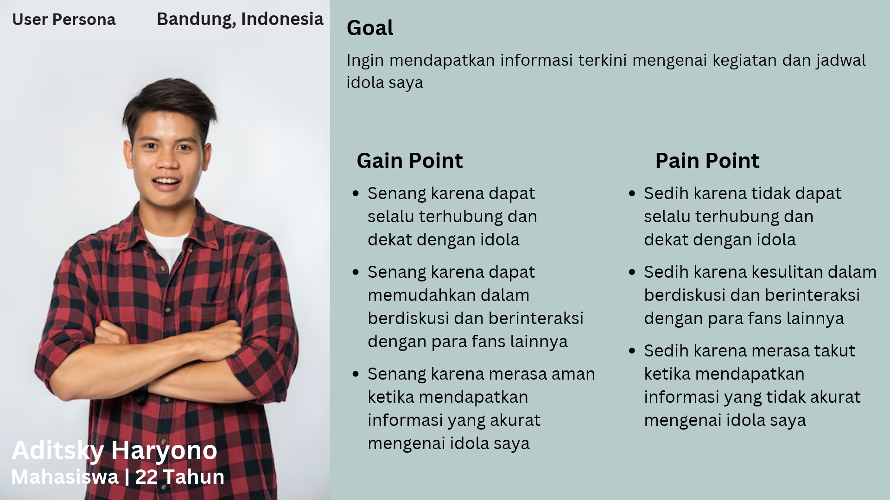
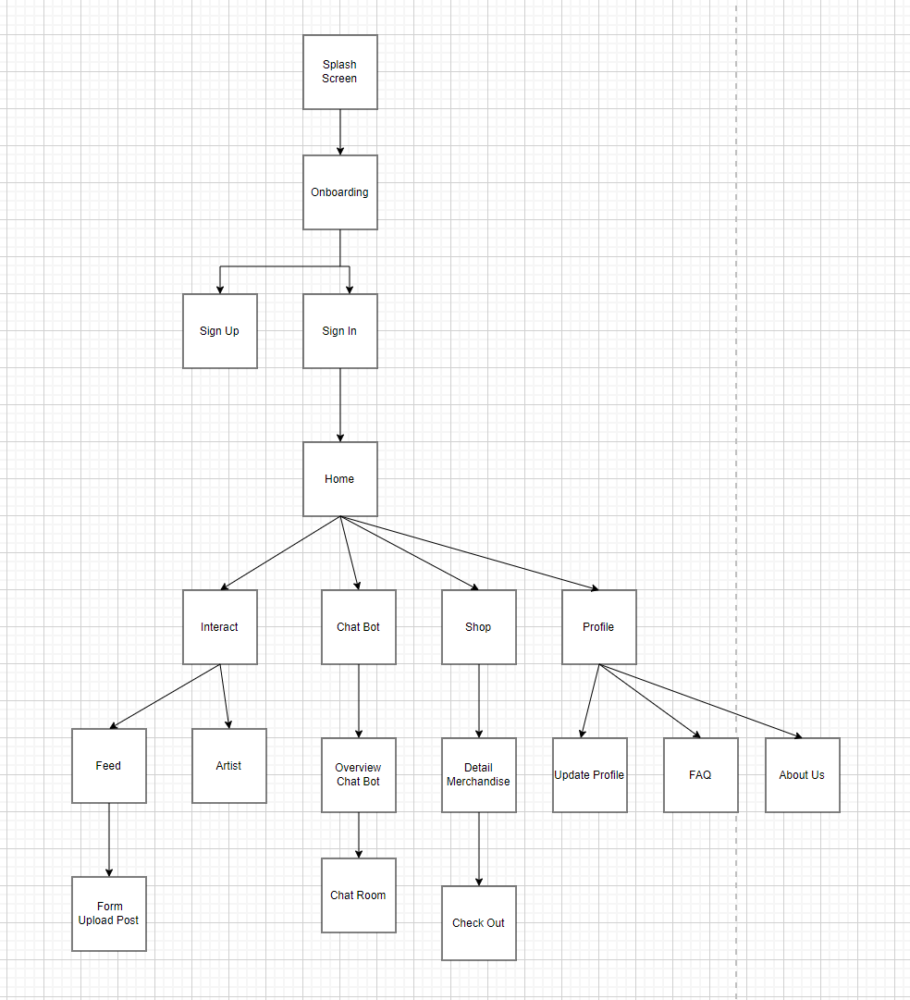

# StarWave 
An end-to-end UX research and interface wireframing project for StarWave, an interactive mobile platform connecting fans with their favorite idols through exclusive community feeds, direct artist updates, an AI customer support chatbot, and an official merchandise marketplace.

## Project Overview
While mainstream social media platforms allow fans to follow public figures, interactions often feel detached, unorganized, and saturated with unreliable news. Additionally, acquiring verified official merchandise remains fragmented and prone to scams. StarWave bridges this gap by offering a dedicated fan engagement ecosystem designed for users aged 13–30 in Indonesia, prioritizing community closeness, verified artist announcements, and integrated official shopping.

## Target Users & Persona
Two distinct user archetypes were developed to guide user needs, goals, and interface hierarchy:
* **Persona 1 (Aditsky Haryono, 22):** Highly active college student seeking reliable, real-time schedule updates and community discussion channels.
* **Persona 2 (I Ketut Sarah Anjayani, 18):** Enthusiast fan prioritizing verified official merchandise purchases and exclusive artist media access.

## UX Research & Information Architecture
* **User Journey Mapping:** Documented cross-phase user motivations, emotional highs and lows, internal application behaviors, and identified product improvement opportunities.
* **Task Flows:** Modeled 10 sequential task flows covering onboarding, community posting, liking artist feeds, AI chatbot queries, product checkout, and profile settings.
* **Navigation Map:** Structured the application hierarchy around 5 core navigation anchors: **Home**, **Interact**, **Chat Bot**, **Shop**, and **Profile**.

## Wireframing & Interaction Design
The wireframes lay out structural component placement, layout hierarchies, and screen navigation rules before high-fidelity styling:
* **Authentication & Onboarding:** Carousel introduction, registration validation, and sign-in feedback pop-ups.
* **Home Feed & Discovery:** Auto-sliding banner carousels, horizontal trending merchandise cards, and new artist joining highlights.
* **Interact:** Dual-tab interface supporting fan-generated posts with image attachments and verified artist posts with reaction controls.
* **AI Chat Bot:** Dedicated conversational room for platform support and artist schedule inquiries.
* **Merchandise Store & Checkout:** Two-column product grid, item detail previews, single-item direct checkout modal, and delivery information handling.
* **Profile, Accordion FAQ & Draggable Maps:** User detail management, expandable/collapsible accordion FAQ blocks, and headquarter location map views.

## High-Fidelity UI & Prototype
Translated user flows and low-fidelity layouts into a high-fidelity visual interface and interactive prototype featuring component styling, auto layouts, and transitions.

## Project Links & Deliverables
* **Figma Wireframe (Low/Mid-Fi):** [View Wireframe on Figma](https://www.figma.com/design/4cNVZhn8ZvhibAv4TMnCqW/Wireframe---StarWave---2?node-id=0-1&t=Gtef8y300HosXd4R-1)
* **Figma UI/UX Design & Prototype (Hi-Fi):** [View UI Design on Figma](https://www.figma.com/design/Q33aQNBk3lPMuYkFS8sNsk/Starwave?node-id=0-1&t=QuCZbbMbV0b5OxrR-1)
* **User Journey Sheet:** [View User Journey Mapping](https://docs.google.com/spreadsheets/d/1s5ffKToP3hFsdueUCFjaHkirFmfgBtTa/edit?usp=drive_link&ouid=106000366178555106389&rtpof=true&sd=true)

## Contributors
* Darren Nathaniel Chandra
* Thio Michael Yulianto
